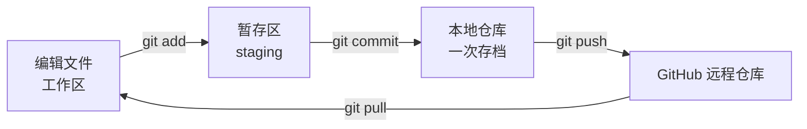
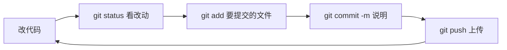
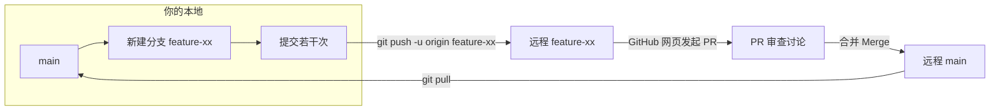

# Git + GitHub 协作操作手册（从零到协作）

> 本手册用于自学 Git / GitHub 协作，**不依赖任何 AI 助手**，跟着命令一步步敲即可。
> 配套练习仓库：本地 `git_learning/` ↔ 远程 `https://github.com/Mikorchara/Git-.git`

---

## 0. 先理解几个概念（30 秒版）

| 名词 | 是什么 | 生活比喻 |
|------|--------|----------|
| **仓库 (Repository)** | 项目文件夹 + 完整的修改历史 | 一个游戏存档 |
| **提交 (Commit)** | 一次「存档」，记录了某个时刻所有文件的样子 | 手动存档点 |
| **分支 (Branch)** | 一条独立的时间线，互不干扰 | 平行宇宙 |
| **暂存区 (Staging Area)** | 提交前先「挑选要存档哪些改动」的中间区 | 打包前的整理台 |
| **工作区 (Working Tree)** | 你当前正在编辑的真实文件 | 你眼前的草稿 |
| **远程 (Remote)** | 云端仓库（GitHub 上的那份副本） | 云备份 / 共享盘 |
| **推送 (Push)** | 把本地提交上传到远程 | 把存档上传云端 |
| **拉取 (Pull)** | 把远程最新改动下载并合并到本地 | 下载队友的新存档 |
| **克隆 (Clone)** | 把远程仓库完整复制到本地（首次） | 从云盘下载整个项目 |
| **PR (Pull Request)** | 请求把「某个分支」合并进「主分支」，可代码审查 | 提交一份「合并申请」 |

### 一次提交的完整生命周期



> 记住口诀：**改(add) → 存(commit) → 传(push)**
> 本地和远程是**两份独立**的历史，靠 `push` / `pull` 同步。

---

## 1. 一次性准备

### 1.1 确认已安装 Git 并查看版本

```bash
git --version
# 预期输出示例：git version 2.4x.x.windows.1
```

### 1.2 配置身份（提交时会记录「谁改的」）

> ⚠️ 你的电脑可能已经配过（本次检测到：`FakeMikorchara` / `2453028060@qq.com`）。
> 这个名字会显示在你的 GitHub 提交记录上，**建议改成你 GitHub 账号显示的名字**：

```bash
git config --global user.name  "Mikorchara"        # 改成你的 GitHub 用户名
git config --global user.email "你的邮箱@example.com" # 用 GitHub 绑定的邮箱
```

验证：

```bash
git config --global user.name
git config --global user.email
```

> `--global` = 这台电脑所有仓库生效；想只对当前仓库生效就删掉 `--global`。

### 1.3 认证方式（HTTPS + 凭据管理器）

本次教程用 **HTTPS** 方式推送。Windows 通常已自带 **Git Credential Manager**。
**第一次 push 时会自动弹出 GitHub 登录窗口**（浏览器或小弹窗），登录一次后凭据会被安全记住，之后不再需要输。

> 💡 进阶：常用 **SSH 密钥** 方式（`git@github.com:...`），免输密码更安全，学完本手册可自行了解。

---

## 2. 场景 A：把已有文件夹推送到「空」远程仓库 ⭐（本次目标）

> 你的远程仓库 `Git-` 现在还是**空的**（GitHub 新建仓库时「不要勾选 README」即为空）。
> 这是最经典的入门场景。**打开终端，cd 到你的项目文件夹**，然后逐步执行：

### 第 1 步：进入文件夹并初始化本地仓库

```bash
cd d:\MyProject\Learning\git_learning
git init
```

- `git init` = 在当前文件夹创建 `.git` 隐藏目录（本地仓库的「心脏」）
- 预期输出：`Initialized empty Git repository in ...`

> 只执行一次。之后这个文件夹就是 Git 仓库了。

### 第 2 步：看看有哪些文件、什么状态

```bash
git status
```

- 红色文件 = 还没被 Git「跟踪」的新文件（你的 `code.py`、`test.txt` 会显示红色）

### 第 3 步：把所有文件加入暂存区

```bash
git add .
```

- `git add <文件>` 加单个；`git add .` 加当前目录所有改动
- 再跑 `git status`：文件变成**绿色** = 已在暂存区，等待提交

### 第 4 步：创建第一次提交（存档）

```bash
git commit -m "first commit"
```

- `-m` 后面是**提交说明**，要写清楚「这次改了什么」，方便以后回看
- 预期输出会列出 `1 file changed / 2 files changed ...`

> 再跑 `git status`：会提示 `nothing to commit, working tree clean` = 工作区干净，存档完成 ✅

### 第 5 步：把分支改名为 main（GitHub 默认主分支名）

```bash
git branch -M main
```

- 新仓库默认主分支叫 `master`，GitHub 习惯用 `main`
- `-M` = 改名（move，大写强制）

### 第 6 步：关联远程仓库

```bash
git remote add origin https://github.com/Mikorchara/Git-.git
```

- `origin` = 给远程仓库起的**默认别名**（可自定义，但约定俗成用 origin）
- `git remote -v` 验证 → 会显示 fetch / push 两个地址

> 如果报 `fatal: remote origin already exists`，说明之前关联过：
> ```bash
> git remote set-url origin https://github.com/Mikorchara/Git-.git   # 或先 remove 再 add
> ```

### 第 7 步：推送到远程（首次上传）

```bash
git push -u origin main
```

- `-u`（= `--set-upstream`）= 记住「本地 main 跟踪远程 origin/main」，以后直接 `git push` 就行
- **首次会弹 GitHub 登录**，登录即可
- 成功后刷新 GitHub 页面 → 仓库里能看到你的文件了 🎉

---

## 3. 日常开发循环（以后每天都用这套）



```bash
# 1. 查看状态（红色=未跟踪/已修改，绿色=已暂存）
git status

# 2. 把改动加入暂存区（可只加部分文件）
git add code.py

# 3. 提交存档
git commit -m "添加了某某功能"

# 4. 推送到 GitHub
git push

# 5. 查看提交历史（按 q 退出）
git log --oneline
```

### 3.1 撤销操作（学会救自己）

| 想做什么 | 命令 |
|---------|------|
| 撤销某个文件的改动（还没 add） | `git checkout -- 文件名` |
| 把已暂存的文件撤回暂存区 | `git reset HEAD 文件名` |
| 修改上一次提交说明 | `git commit --amend -m "新说明"` |
| 回到过去某个提交（查看） | `git log --oneline` 记下 hash，`git checkout <hash>` |
| 强制回退本地到远程一致 | `git reset --hard origin/main`（⚠️ 会丢本地改动，慎用） |

### 3.2 .gitignore（忽略不该提交的文件）

项目里常有密钥、缓存、虚拟环境等**不该上传**的文件，用 `.gitignore` 声明：

```gitignore
# 示例：新建一个 .gitignore 文件
__pycache__/
*.pyc
.venv/
config.properties   # 含密钥的配置文件
```

> 记得先 `git add .gitignore` 再提交，之后被忽略的文件就不会再出现在 status 里。

---

## 4. 场景 B：换电脑 / 加入他人项目（克隆 + 拉取）

### 4.1 首次拿到项目 → 克隆

```bash
# 在「想放项目的地方」执行，不要手动建文件夹（clone 会自动建）
git clone https://github.com/Mikorchara/Git-.git
cd Git-
```

### 4.2 别人推了新代码 → 拉取更新

```bash
git pull
```

> 等价于 `git fetch`（下载） + `git merge`（合并），一步到位。

### 4.3 团队协作正确姿势：**先 pull 再 push**

```bash
git pull          # 1. 先把远程最新改动拉下来合并
# ... 解决冲突（见 5.4）...
git push          # 2. 再推自己的改动
```

---

## 5. 协作进阶：分支 + Pull Request（团队标准流程）⭐

单人直接推 `main` 没问题；**多人协作**时直接在 main 上改会互相踩踏。
标准做法是「**开分支干活 → 发起 PR → 审查合并**」。



### 5.1 完整流程（命令版）

```bash
# 1. 确认在干净的 main 上
git checkout main
git pull

# 2. 新建并切换到新分支（-b = branch 创建+切换）
git checkout -b feature/add-login

# 3. 正常改代码、提交
git add .
git commit -m "添加登录功能"

# 4. 推送这个分支到远程（首次用 -u）
git push -u origin feature/add-login
```

### 5.2 在 GitHub 网页上发起 PR

1. push 后终端会显示一行链接，或打开仓库页面会看到黄色横幅 **「Compare & pull request」**
2. 点进去 → 确认 `base: main` ← `compare: feature/add-login`
3. 写 PR 标题和说明 → 点 **Create pull request**
4. 可邀请人 **Review**（代码审查）；讨论满意后点 **Merge pull request** 合并

### 5.3 合并后清理

```bash
# 切回主分支并更新
git checkout main
git pull

# 删除本地分支
git branch -d feature/add-login

# 删除远程分支（GitHub 上也可点 Delete branch）
git push origin --delete feature/add-login
```

### 5.4 冲突（Conflict）怎么办

多人改了同一文件同一区域时，`git pull` / 合并会提示冲突：

1. Git 会在冲突文件里标出两个版本：
   ```
   <<<<<<< HEAD
   你的改动
   =======
   对方的改动
   >>>>>>> 分支名
   ```
2. **手动编辑**，保留想要的（两边都要就都留），删掉 `<<<<<<< ======= >>>>>>>` 标记行
3. 保存后：
   ```bash
   git add 冲突文件
   git commit -m "解决冲突"
   ```

> 不要慌，冲突是正常现象。原则：**先想清楚要保留什么，删干净标记行**。

---

## 6. 常用命令速查表

| 操作 | 命令 |
|------|------|
| 初始化仓库 | `git init` |
| 查看状态 | `git status` |
| 加入暂存区 | `git add .` |
| 提交 | `git commit -m "说明"` |
| 查看历史 | `git log --oneline` |
| 推送 | `git push` |
| 拉取 | `git pull` |
| 克隆 | `git clone <url>` |
| 关联远程 | `git remote add origin <url>` |
| 查看远程 | `git remote -v` |
| 看当前分支 | `git branch` |
| 新建+切换分支 | `git checkout -b <分支名>` |
| 切换分支 | `git checkout <分支名>` / `git switch <分支名>` |
| 删除本地分支 | `git branch -d <分支名>` |
| 查看所有分支含远程 | `git branch -a` |
| 放弃未暂存改动 | `git checkout -- <文件>` |
| 查看某文件改动 | `git diff` / `git diff --cached` |

---

## 7. 常见错误与解决

| 报错 | 原因 | 解决 |
|------|------|------|
| `fatal: not a git repository` | 不在 git 仓库里（或没 init/clone） | `cd` 进正确目录，或 `git init` |
| `fatal: remote origin already exists` | 已关联过远程 | `git remote set-url origin <新url>` 或先 `git remote remove origin` |
| `fatal: repository not found` | 仓库不存在 / 无权访问 | 检查 URL 是否拼对、是否私有仓库需要登录 |
| `Authentication failed` | 登录失效 | 重新走一次 GitHub 登录；或更新凭据 |
| `! [rejected] ... fetch first` | 远程有本地没有的提交 | `git pull` 合并后再 `git push` |
| `hint: Pulling without specifying how to reconcile...` | pull 策略提示 | 初次配置一次：`git config --global pull.rebase false` |
| 409 `Git Repository is empty` | 远程是空仓库（没任何分支） | 首次用 `git push -u origin main` 推内容即可（本次场景） |

---

## 8. 自学进阶路径（按需选读）

1. **Git 官方交互教程**：https://learngitbranching.js.org/ （可视化练分支，强烈推荐）
2. **Git 官方文档**：https://git-scm.com/book/zh/v2 （Pro Git 中文版，免费）
3. **GitHub Skills**：https://skills.github.com/ （官方免费实操课）
4. 进阶主题：SSH 密钥、`git rebase`、`git stash`、`GitHub Issues`、`GitHub Actions`
5. 终端里随时求助：`git help <命令>` 或 `git <命令> --help`

> 想练手就多建几个空仓库、乱提交乱分支，反正仓库是你的，大胆折腾。
> 唯一保命原则：**重要代码先 commit，push 到 GitHub 就是最好的备份**。
