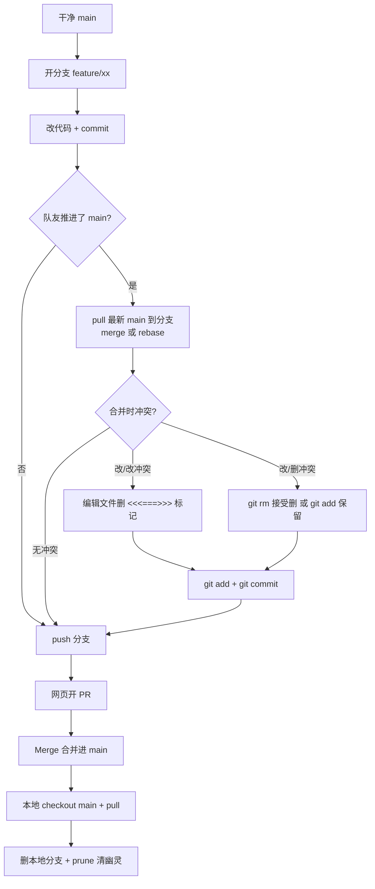

# 分支的建立 → 冲突的处理（实战手册）

> 本文档记录一次「两个协作者 + 共享远程」的完整冲突实战：从开分支、提交、推送，到三种合并结果的亲历与解决。
> 配套阅读 `GitHub协作操作手册.md` 第 5 节（那是概念版，这里是实战版）。
> 练习仓库：本地 `git_learning/`（= 队友） + `git_clone/`（= 你） ↔ 远程 `https://github.com/Mikorchara/Git-.git`

---

## 0. 一句话脉络

```
干净 main
  → 开分支干活（改了文件、提交）
  → 期间队友也推进了 main（你的分支落后且分叉了）
  → 把你的分支拉取/合并最新 main
  → 结果分三种：无冲突 / 改改冲突 / 改删冲突
  → 有冲突就手动解决 → 提交
  → push 分支 → PR 合并 → 清理
```

---

## 1. 先分清"三层分支"，否则会晕

| 层级 | 是什么 | 存在于哪 | 怎么删 |
|------|--------|---------|--------|
| **本地分支** `feature/xx` | 你自己电脑上的工作分支 | 本地 `.git` | `git branch -d/-D feature/xx` |
| **远程跟踪引用** `origin/feature/xx` | 本地缓存里"远程曾有此分支"的记录 | 本地 `.git` | `git fetch --prune` |
| **远程分支** `feature/xx`（网页上看到的） | GitHub 服务器上的真实分支 | GitHub | 网页 Delete branch 或 `git push origin --delete feature/xx` |

> ⚠️ **三者各删各的，互不影响**：本地删了，远程还在；远程删了，本地不会自动消失，本地的 `origin/xx` 引用还会变成"幽灵分支"赖在 `git branch -a` 里，直到 `git fetch --prune` 超度它。

---

## 2. 建分支前的准备

### 2.1 为什么必须从"干净的 main"开分支

新分支是从某个提交上"长"出来的。如果 main 上还有没提交的改动，或 main 已经落后远程，你开出来的分支就会带病/落伍。

```bash
git checkout main      # 切回主分支
git pull               # 同步到远程最新（干净起点）
git status             # 确认 working tree clean
```

### 2.2 HEAD 是什么

- **HEAD** = "你当前站在哪个提交"的指针。
- `HEAD -> main` = 你正站在 main 分支上，提交会跟着 main 走。
- `HEAD -> feature/add-login` = 你在功能分支上。
- 图形里 `(HEAD -> main, origin/main)` = 本地 main 和远程 main 指向同一个提交（同步）。

### 2.3 分支名前的 `feature/` 是什么

**纯命名约定，不是强制**。Git 允许任何名字。`feature/xxx` 只是让人一眼看出用途：

| 前缀 | 含义 | 例子 |
|------|------|------|
| `feature/` | 新功能 | `feature/add-login` |
| `fix/` 或 `bugfix/` | 修 bug | `fix/null-pointer` |
| `hotfix/` | 紧急修复 | `hotfix/payment` |
| `release/` | 发版 | `release/v1.2.0` |

---

## 3. 开分支 → 提交 → 推送

```bash
# ① 建分支并切过去（-b = branch 创建 + 切换）
git checkout -b feature/add-login
#   等价写法：git switch -c feature/add-login

# ② 正常改代码、提交
git add .
git commit -m "添加登录功能"

# ③ 首次推送这个分支到远程（必须带 -u，否则报 no upstream branch）
git push -u origin feature/add-login
#   -u = 建立跟踪；以后同一分支直接 git push / git pull 即可
```

> 首次直接敲 `git push` 会报：
> `fatal: The current branch feature/add-login has no upstream branch.`
> 这不是坏事，只是 Git 在提醒你"还没告诉它推去哪"。

### 3.1 push ≠ PR（最容易混的一对）

| | push | PR |
|---|------|-----|
| 谁的动作 | **Git** 命令 | **GitHub 网页**功能 |
| 干什么 | 把分支**上传**到远程 | 向仓库**申请**把分支合并进 main |
| 是 Git 概念吗 | 是 | 不是（GitHub 的协作功能） |

**push 是 PR 的前置**：不 push，网页上没有分支可发起 PR。但 push 完**不会自动合并**，要手动去网页点 "Compare & pull request" → Create → Merge。

---

## 4. 纠正一个认知：为什么"push 前要 pull"

很多人以为"本地 main 没同步远程 main，push 就会报错"——**错**。

- **push 会不会被拒，只取决于"你推的分支"和"远程同名分支"**：若你落后于远程同名分支 → `! [rejected] non-fast-forward`；若是首次推送新分支 → 永远不会被拒。
- 本地 main 落不落后远程 main，**与 push 无关**。

那"先 pull 最新 main 到你的分支"的意义是什么？

> **不是为了 push 能通过，而是为了提前在本地发现并解决冲突，让 PR 干净无冲突。**

如果不 pull 就 push 分支，push 照样成功；但开 PR 时 GitHub 会比对分支与 main，发现冲突就会红字提示 "This branch has conflicts"，无法直接合并——那时还是得回来同步解决。

---

## 5. 三种冲突实战（核心）

### 5.1 冲突是怎么来的

你和队友从同一个 base 出发，各自提交，最后要合并时，同一处出现了两种不同改法：

```
main:        base --- X(队友推进) --- ...
                      \
你的分支:            \--- Y(你的提交)
```

Git 要合并 X 和 Y，如果它们动了**同一文件的同一区域**，Git 无法替你决定 → 冲突。

### 5.2 结果一：无冲突（最爽）

两人改的是**不同文件**（或同一文件的不同区域），`git pull` / merge 自动合并成功：

```
Auto-merging note.txt
Merge made by the 'ort' strategy.
```

**什么都不用做**，直接进入第 6 节收尾。

### 5.3 结果二：改/改冲突（CONFLICT (content)）

两人改了**同一文件的同一行/区域**。报错：

```
Auto-merging test.txt
CONFLICT (content): Merge conflict in test.txt
Automatic merge failed; fix conflicts and then commit the result.
```

打开冲突文件，会看到 Git 留下的"战场标记"：

```
<<<<<<< HEAD                 ← 开始标记（下面=【我这边】）
Hello World from ME          ←   你分支的版本
=======                      ← 分界线
Hello World from TEAM        ←   对方(拉进来的)版本
>>>>>>> 62c983c1...702c      ← 结束标记（对方的提交号）
```

| 标记 | 含义 |
|------|------|
| `<<<<<<< HEAD` | 下方 = 你当前分支的内容 |
| `=======` | 上我下他 的分隔线 |
| `>>>>>>> 提交号` | 下方（到此处前）= 对方/远程的内容 |

**解决步骤：**

1. 手动编辑文件：选择保留哪个版本（或两个都要、或合并成新句）。
2. **三个标记行（`<<<<<<<` `=======` `>>>>>>>`）必须全部删干净**，只留正文。
3. 保存 → 告诉 Git 处理好了 → 完成合并：

```bash
git add test.txt
git commit -m "解决 test.txt 冲突，保留 ME 版"
```

> 反悔保险：合并到一半想退出，`git merge --abort` 回到合并前。

### 5.4 结果三：改/删冲突（CONFLICT (modify/delete)）

**队友删了文件，而你正在改它**。这次**没有** `<<<<<<<` 标记——因为这是"整文件级"矛盾（文件在不在），没法逐行合并。报错长这样：

```
CONFLICT (modify/delete): greet.py
    deleted in b8f9dc1...          ← 对方把 greet.py 删了
    and modified in HEAD           ← 你改了 greet.py
    Version HEAD of greet.py left in tree.
                                     ← Git 先把你的版本留在工作区，等你决定
```

Git 不擅自杀你的劳动成果——它把决定权交给你，**二选一**：

```bash
# 方案 A：认同对方，接受删除（这功能不要了）
git rm greet.py
git commit -m "接受对方删除 greet.py"

# 方案 B：坚持保留你的版本
git add greet.py
git commit -m "保留我的 greet.py 修改"
```

**怎么判断**：看对方删除时的提交说明。若"整个功能废弃"而删 → 你的修改是给废代码续命，多半选 A；若误删/重构、你的新改动另有用 → 选 B。

---

## 6. 冲突解决后会怎样？（看历史图）

无论哪种冲突，`git add` + `git commit` 后都会生成一个**合并提交（merge commit）**。用图看：

```bash
git log --oneline --graph -6
```

```
*   b6c514e (HEAD -> feature/me-del) 保留我的 greet.py 修改
|\
| * b8f9dc1 对方: 清理废弃的 greet.py      ← 第二父（拉进来的）
* | 4401955 我: 给 greet.py 加了一行        ← 第一父（你分支的）
|/
*   373a374                                 ← 共同祖先
```

那个 `|\ /` 的"入"字形就是**侧线**——它记录"曾经从这里合并过"，是**永久历史**，删除分支也不会消失。想让历史一条直线，只能用 squash merge / rebase，那是另一种合并策略。

---

## 7. 合并完成后的标准收尾

```bash
# ① 切回主分支并更新
git checkout main
git pull

# ② 删除本地分支
#    -d：只有"已合并"才允许删（安全）
#    -D：强制删（未合并也删，会丢该分支独有内容，慎用）
git branch -d feature/add-login

# ③ 删除远程分支（网页 PR 后点 Delete branch 也一样）
git push origin --delete feature/add-login

# ④ 超度"幽灵分支"：清掉远程已删、本地还记着的 origin/xxx 引用
git pull --prune
#    等价于 git fetch --prune
```

---

## 8. 快速自查：环境是否干净（三件套）

| 检查什么 | 命令 | 干净的样子 |
|---------|------|-----------|
| 当前分支 + 工作区 | `git status -sb` | `## main...origin/main`（无 ahead/behind、无文件） |
| 有无残留/幽灵分支 | `git branch -a` | 只剩 `main` 和 `origin/main` |
| 历史是否与远程对齐 | `git log --oneline -1` | 提交号 = `git ls-remote --heads origin main` 的结果 |

> 注意：`git status` 说"同步"可能是**假象**——它比较的是本地缓存的 `origin/main` 引用。若你很久没 fetch，引用是旧的，会误报同步。先 `git pull` 一次再判断才准。

---

## 9. 本次实战踩过的坑（速查）

| 坑 | 现象 | 原因 / 解法 |
|----|------|------------|
| 在两个仓库之间"串台" | 编辑器改的是 clone 的文件，终端 git 命令却在 learning 敲 | 先 `cd` 到目标仓库再操作；改文件与敲命令必须在同一仓库 |
| `nothing to commit` | 以为改了文件却提交不了 | 改动要么没保存、要么内容和已提交版本一致；先 `git status` 看有没有 `M` |
| 误在"已最新"的 main 上开分支 | 怎么都不冲突 | 冲突前提是分支**基于旧版**；要故意制造冲突，先在旧 main 开分支再让队友推进 |
| push 报 `no upstream branch` | 首次推新分支直接 `git push` | 首次必须 `git push -u origin 分支名` |
| `! [rejected] fetch first` | push 落后于远程同名分支 | `git pull` 合并后再 push |
| 幽灵分支删不掉 | 网页删了远程分支，本地 `git branch -a` 还有 `origin/xx` | 那不是本地分支，是缓存引用，用 `git fetch --prune` |

---

## 10. 一张流程图收尾



> 保命原则：**重要代码先 commit，push 到 GitHub 就是最好的备份；冲突别慌，Git 只是停下来问你，它从不擅自丢你的东西。**
